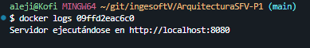

# ArquitecturaSFV-P1

# Evaluación Práctica - Ingeniería de Software V

## Información del Estudiante
- **Nombre:** Alejandro Cordoba Erazo
- **Código:** A00395678
- **Fecha:** 07/03/2025

## Resumen de la Solución
Esta solución automatiza la contenerización y ejecución de una aplicación de Node.js usando Docker y bash, para hacer verificaciones de recursos necesarios y preparación de estos mismos.

## Dockerfile
```Dockerfile
# Usa una imagen base ligera de Node.js
FROM node:18-alpine

# Establece el directorio de trabajo
WORKDIR /app

# Copia solo los archivos necesarios para instalar dependencias, lo hago primero para evitar invalidaciones de caché
COPY package*.json ./

# Instala dependencias con npm ci para mayor consistencia y rendimiento, porque omite la resolucion de versiones
RUN npm ci --only=production

# Copia el resto de los archivos de la aplicación
COPY . .

# Define la variable de entorno para producción
ENV NODE_ENV=production

# Expone el puerto de la aplicación
EXPOSE 8080

# Comando para ejecutar la aplicación
CMD ["node", "app.js"]
```

## Script de Automatización

Este script define las variables de entorno, luego verifica si docker esta instalado, sino lo esta, devuelve una alerta y para, luego, construye la imagen, verifica si el contenedor definido en la variable de entorno existe, si existe, lo eliminar y crea uno nuevo, si no simplemente lo crea, por ultimo crea el contenedor y hace una prueba a la aplicación,
si esta es exitosa dentro de 30s, retorna un mensaje de exito, si no retorna un aviso de error.

```sh
#!/bin/bash

# Nombre de la imagen y contenedor
IMAGE_NAME="node-app"
CONTAINER_NAME="node-app-container"
PORT=8080

# Verificar si Docker está instalado
if ! command -v docker &> /dev/null; then
    echo "Docker no está instalado, por favor, instalar y volver a intentar"
    exit 1
fi

echo "Docker está instalado"

# Construir la imagen de Docker
echo "Construyendo la imagen de Docker..."
docker build -t $IMAGE_NAME .

if [ $? -ne 0 ]; then
    echo "Error al construir la imagen de Docker"
    exit 1
fi

echo "Imagen de Docker construida exitosamente"

# Detener y eliminar contenedor previo si existe
if [ "$(docker ps -aq -f name=$CONTAINER_NAME)" ]; then
    echo "Eliminando contenedor previo..."
    docker stop $CONTAINER_NAME &> /dev/null
    docker rm $CONTAINER_NAME &> /dev/null
fi

# Ejecutar el contenedor
echo "Iniciando el contenedor..."
docker run -d --name $CONTAINER_NAME -p $PORT:8080 -e PORT=$PORT -e NODE_ENV=production $IMAGE_NAME

if [ $? -ne 0 ]; then
    echo "Error al iniciar el contenedor"
    exit 1
fi

TIMEOUT=30
INTERVAL=2
ELAPSED=0

echo "Contenedor iniciado en el puerto $PORT"

echo "Esperando a que la aplicación responda..."

while [ $ELAPSED -lt $TIMEOUT ]; do
    RESPONSE=$(curl -s -o /dev/null -w "%{http_code}" http://localhost:$PORT/health)
    if [ "$RESPONSE" = "200" ]; then
        echo "La aplicación está funcionando correctamente"
        echo "Accede en: http://localhost:$PORT"
        exit 0
    fi
    
    sleep $INTERVAL
    ELAPSED=$((ELAPSED + INTERVAL))
done

echo "Error: La aplicación no respondió correctamente en el tiempo esperado ($TIMEOUT segundos)"
exit 1
```

## Principios DevOps Aplicados
1. Automtización 
2. Medición
3. Mejora continua

## Captura de Pantalla

## Mejoras Futuras
- Hacer un pipeline para que se despliegue en un servidor remoto
- Mostrar el tiempo de construcción y almacenarlo para futuras comparaciones
- Registrar logs de construcción para monitores de fallos contra éxitos

## Instrucciones para Ejecutar

### Requisitos previos

- Tener docker instalado 

- Tener git bash instalado

<a href="https://docs.docker.com/get-started/get-docker/"><image src="https://www.docker.com/app/uploads/2023/05/symbol_blue-docker-logo.png" alt="Descripción de la imagen"  width="70" height="50"></a><a href="https://git-scm.com/downloads"><image src="https://cdn.worldvectorlogo.com/logos/git-bash.svg" alt="Descripción de la imagen"  width="70" height="50"></a>


Dirigente a la carpeta donde quieres clonar el proyecto

```sh
cd ruta/de/tu/carpeta
```

Clonar el repostorio https://github.com/elkofix/parcial-ingesoftV.git en git bash
 
```sh
git clone https://github.com/elkofix/parcial-ingesoftV.git
```

Acceder al repositorio

```sh
cd ArquitecturaSFV-P1
```

Correr el script de ejecución con git bahs

```sh
./build.sh
```

Ya podrás acceder al programa desde http://localhost:8080, con herramientas como curl o postman
